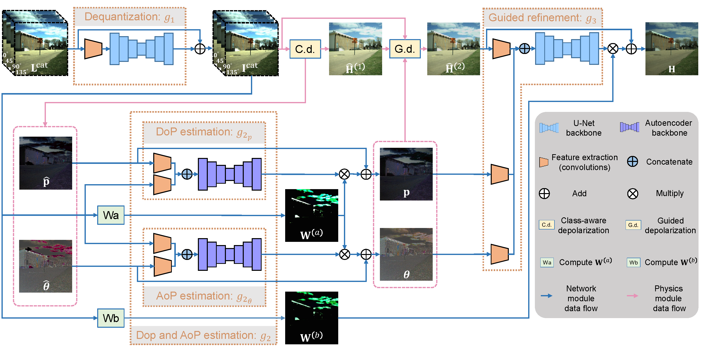

# Polarization Guided HDR Reconstruction via Pixel-Wise Depolarization

By [Chu Zhou](https://fourson.github.io/), Yufei Han, Minggui Teng, Jin Han, Si Li, Chao
Xu, [Boxin Shi](http://ci.idm.pku.edu.cn/)


[PDF](https://ieeexplore.ieee.org/document/10061479/) | [SUPP](http://camera.pku.edu.cn/Zhou_TIP23.pdf)

## Abstract

Taking photos with digital cameras often accompanies saturated pixels due to their limited dynamic range, and it is far
too ill-posed to restore them. Capturing multiple low dynamic range images with bracketed exposures can make the problem
less ill-posed, however, it is prone to ghosting artifacts caused by spatial misalignment among images. A polarization
camera can capture four spatially-aligned and temporally-synchronized polarized images with different polarizer angles
in a single shot, which can be used for ghost-free high dynamic range (HDR) reconstruction. However, real-world
scenarios are still challenging since existing polarization-based HDR reconstruction methods treat all pixels in the
same manner and only utilize the spatially-variant exposures of the polarized images (without fully exploiting the
degree of polarization (DoP) and the angle of polarization (AoP) of the incoming light to the sensor, which encode
abundant structural and contextual information of the scene) to handle the problem still in an ill-posed manner. In this
paper, we propose a pixel-wise depolarization strategy to solve the polarization guided HDR reconstruction problem, by
classifying the pixels based on their levels of ill-posedness in HDR reconstruction procedure and applying different
solutions to different classes. To utilize the strategy with better generalization ability and higher robustness, we
propose a network-physics-hybrid polarization-based HDR reconstruction pipeline along with a neural network tailored to
it, fully exploiting the DoP and AoP. Experimental results show that our approach achieves state-of-the-art performance
on both synthetic and real-world images.

## Prerequisites

* Linux Distributions (tested on Ubuntu 20.04).
* NVIDIA GPU and CUDA cuDNN
* Python >= 3.7
* Pytorch >= 1.10.0
* cv2
* numpy
* tqdm
* tensorboardX (for training visualization)

## Inference

```
python execute/infer_full.py -r checkpoint/full.pth --data_dir <path_to_input_data> --result_dir <path_to_result_data> --data_loader_type InferRealDataLoader default
```

## Pre-trained model and test examples

* We provide the [pre-trained model](https://drive.google.com/drive/folders/11uQFiodYp4Vle-wgRT3T2NOk1JwcMtpe?usp=share_link) for inference
* We provide [some test examples](https://drive.google.com/drive/folders/19vFy2o22G-rnvwUpDFMNdU9N1T4JUZ0z?usp=share_link), each example (saved in `.npy` format) contains four polarized LDR images (0°, 45°, 90°, and 135°) concatenated in the color channel dimension (normalized to `[0,1]`)

## Visualization

Since the file format we use is `.npy`, we provide scrips for visualization:
* For input data, use `scripts/visualize_pol.py`
* For output data, use `scripts/visualize_HDR_Reinhard.py` (or other HDR image visualization methods)

## Training your own model

* We provide the [preprocessed EdPolCommunity dataset](https://drive.google.com/file/d/1Uos83MTcJ-t6Peq-JUCoKmQ9GUPZ6rGR/view?usp=share_link), which is the middle result of our synthetic dataset generation pipeline (the output of step3 in Section V-A of our paper)
* Use `scripts/make_dataset.py` to generate the synthetic dataset from the preprocessed EdPolCommunity dataset (corresponding to step4~6 in Section V-A of our paper)
* Train three subnetworks respectively:
  * Train subnetwork1 (Dequantization):
    ```
    python execute/train.py -c config/subnetwork1.json
    ```
  * Train subnetwork2 (DoP and AoP estimation):
    ```
    python execute/train.py -c config/subnetwork2.json
    ```
  * Train subnetwork3 (Guided refinement):
    ```
    python execute/train.py -c config/subnetwork3.json
    ```
* Finetune the entire network in an end-to-end manner:
```
python execute/train.py -c config/full.json --subnetwork1_checkpoint_path <path_to_subnetwork1_checkpoint> --subnetwork2_checkpoint_path <path_to_subnetwork2_checkpoint> --subnetwork3_checkpoint_path <path_to_subnetwork3_checkpoint>
```

Note that all config files (`config/*.json`) and the learning rate schedule function (MultiplicativeLR)
at `get_lr_lambda` in `utils/util.py` could be edited

## Citation

If you find this work helpful to your research, please cite:

```
@article{zhou2023polarization,
  title = {Polarization Guided HDR Reconstruction via Pixel-Wise Depolarization},
  author = {Zhou, Chu and Han, Yufei and Teng, Minggui and Han, Jin and Li, Si and Xu, Chao and Shi, Boxin},
  journal = {IEEE Transactions on Image Processing},
  year = {2023}
}
```